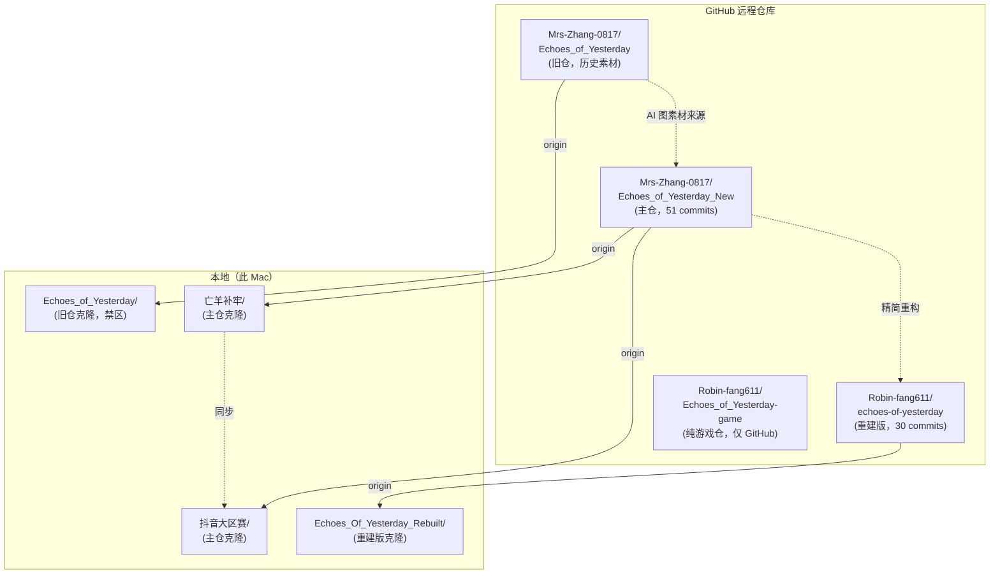

# 仓库关系图

## Mermaid 关系图

## 仓库详情

### 1. 主仓：Mrs-Zhang-0817/Echoes_of_Yesterday_New

| 属性 | 值 |
|------|-----|
| 远程 URL | https://github.com/Mrs-Zhang-0817/Echoes_of_Yesterday_New.git |
| 本地克隆 | 亡羊补牢/（游戏开发工作区） |
| 另一克隆 | 抖音大区赛/ |
| 总提交数 | 51 |
| 运行主体 | `index.html` → `src/main_new.js`，纯前端 Canvas |
| 包体 | ~1.8GB（含源码+运行素材+未验收美术+历史文件） |

#### 本地分支

| 分支 | 状态 |
|------|------|
| `main` | 本地领先 origin/main 3 个提交；完整可运行版本 |
| `fix/stability` | bug 修复工作分支，已修复 P0-1/P1-1/P1-2 + Loader 白屏 |
| `codex/high-fidelity-plan` | **当前分支**，高保真归档体验版本 |
| `fix/visual-audit-build` | 视觉审计与构建修复 |
| `test-smoke` | 冒烟测试分支 |

#### 远程分支

| 分支 | 状态 |
|------|------|
| `origin/main` | 落后本地 ~3 个 commits |

### 2. 旧仓：Mrs-Zhang-0817/Echoes_of_Yesterday（禁区）

- **只读**，不修改、不提交、不推送
- `Echoes_of_Yesterday/` 目录在项目根目录，被 `.gitignore` 忽略
- 包含大量 AI 生成美术素材（36 张），作为比赛备忘录中美术资源概览的来源
- 与主仓关系：旧仓是初始项目，主仓 New 版本是在其上重建的

### 3. 重建版：Robin-fang611/echoes-of-yesterday

| 属性 | 值 |
|------|-----|
| 远程 URL | https://github.com/Robin-fang611/echoes-of-yesterday.git |
| 本地目录 | Echoes_Of_Yesterday_Rebuilt/ |
| 总提交数 | 30 |
| 包体 | 230MB（压缩后 7.8MB） |
| 定位 | 精简/重构版 |

详见 10-02-重建版说明.md。

#### 本地分支

| 分支 | 状态 |
|------|------|
| `main` | 领先 origin/main 0 个 commits |
| `extract-ch1-3` | 另存的分支（仅保留 ch1-3 的轻量版） |

#### 远程分支

| 分支 | 状态 |
|------|------|
| `origin/main` | 与本地 main 同步 |

### 4. 纯游戏仓：Robin-fang611/Echoes_of_Yesterday-game

- 仅存在于 GitHub，本地无克隆
- 与重建版同属 Robin-fang611 个人账户
- 用途不确定，疑似纯游戏运行包存档

## 分支差异总结

- 主仓本地 `main` 领先远程 3 个 commits（需用户手动 push）
- 重建版 `main` 与远程同步（无未推送 commits）
- `codex/high-fidelity-plan` 是当前工作分支，不在此次文档目标中
- `fix/stability` 分支的修复已全部合入 `main`

## 项目间关系

1. **主仓**（Echoes_of_Yesterday_New）是当前开发的活动仓库，所有工作在此进行
2. **重建版**（echoes-of-yesterday）是主仓的精简/重构版本，独立远程仓库
3. **旧仓**（Echoes_of_Yesterday）是初始版本，仅作为素材来源参考
4. **抖音大区赛/** 与 **亡羊补牢/** 是同一主仓的两个本地克隆
